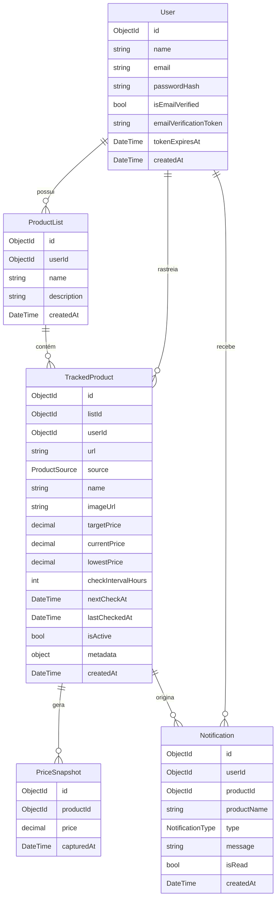
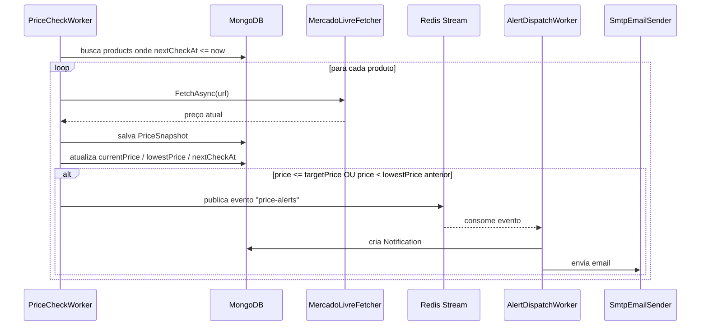

# PriceWatch — Arquitetura

## Stack

| Decisão | Escolha | Justificativa |
|---|---|---|
| Linguagem / plataforma | C# / .NET 8 (ASP.NET Core) | Objetivo de aprender .NET |
| Arquitetura | Clean Architecture | Domain sem dependências externas — maior testabilidade |
| Banco principal | MongoDB | PriceSnapshot é série temporal, sem joins — document store ideal |
| Cache + mensageria | Redis Streams | Infra única para rate limiting e fila de alertas |
| Email dev | MailHog | SMTP fake local, zero config |
| Email prod | MailKit (SMTP) | Leve, sem SDK proprietário |
| Fonte de preços (MVP) | Mercado Livre API oficial | Sem risco de bloqueio; extensível via `IPriceFetcher` |
| Documentação | Swagger (Swashbuckle) | Padrão ASP.NET Core |
| Auth | JWT | Stateless, padrão para API-only |

## Estrutura de Projetos

```
PriceWatch/
├── src/
│   ├── PriceWatch.Domain/
│   │   ├── Entities/           ← User, ProductList, TrackedProduct, PriceSnapshot, Notification
│   │   ├── Enums/              ← ProductSource, NotificationType
│   │   ├── Interfaces/
│   │   │   ├── Repositories/   ← IUserRepository, IProductListRepository, etc.
│   │   │   └── Services/       ← IPasswordHasher, ITokenService, IEmailSender, IAlertPublisher, IPriceFetcher
│   │   └── Exceptions/         ← NotFoundException (abstract) + específicas por domínio
│   │
│   ├── PriceWatch.Application/
│   │   ├── UseCases/
│   │   │   ├── Auth/
│   │   │   ├── ProductLists/
│   │   │   ├── TrackedProducts/
│   │   │   ├── Notifications/
│   │   │   └── Pricing/
│   │   └── DTOs/
│   │
│   ├── PriceWatch.Infrastructure/
│   │   ├── Persistence/MongoDB/
│   │   │   ├── Documents/
│   │   │   ├── Repositories/
│   │   │   └── Mappings/
│   │   ├── Streams/            ← RedisStreamPublisher, RedisStreamConsumer
│   │   ├── Email/              ← SmtpEmailSender
│   │   ├── Fetchers/           ← MercadoLivreFetcher, PriceFetcherResolver
│   │   └── Security/           ← BcryptPasswordHasher, JwtTokenService
│   │
│   └── PriceWatch.API/
│       ├── Controllers/
│       ├── Workers/            ← PriceCheckWorker, AlertDispatchWorker
│       ├── Middleware/         ← ExceptionHandlingMiddleware, RateLimitingMiddleware
│       └── Extensions/         ← ServiceCollectionExtensions
│
├── tests/
│   ├── PriceWatch.UnitTests/
│   └── PriceWatch.IntegrationTests/
│
├── docs/
│   ├── requisitos.md
│   ├── arquitetura.md
│   └── classes.md              ← criado no primeiro commit de código
│
└── docker-compose.yml          ← mongodb + redis + mailhog
```

## Modelo de Dados



## Fluxo de Rastreamento



## Endpoints

### Auth — `/api/auth`

| Método | Path | Auth | Descrição |
|---|---|---|---|
| POST | `/register` | Não | Cadastro com email + senha |
| POST | `/login` | Não | Login → retorna JWT |
| POST | `/verify-email` | Não | Confirma token de verificação |
| POST | `/resend-verification` | Não | Reenvio do email de verificação |

### Product Lists — `/api/lists`

| Método | Path | Auth | Descrição |
|---|---|---|---|
| GET | `/` | Sim | Lista todas as listas do usuário |
| POST | `/` | Sim | Cria nova lista |
| PUT | `/{id}` | Sim | Atualiza nome/descrição |
| DELETE | `/{id}` | Sim | Remove lista (e produtos vinculados) |
| GET | `/{id}/analysis` | Sim | Produtos ordenados por distância do alvo |

### Tracked Products — `/api/lists/{listId}/products`

| Método | Path | Auth | Descrição |
|---|---|---|---|
| GET | `/` | Sim | Lista produtos da lista |
| POST | `/` | Sim | Adiciona produto (URL + preço-alvo) |
| PUT | `/{id}` | Sim | Atualiza preço-alvo ou status |
| DELETE | `/{id}` | Sim | Remove produto |
| GET | `/{id}/history` | Sim | Histórico de PriceSnapshots |

### Notifications — `/api/notifications`

| Método | Path | Auth | Descrição |
|---|---|---|---|
| GET | `/` | Sim | Lista notificações (paginado, filtro isRead) |
| PATCH | `/{id}/read` | Sim | Marca como lida |
| PATCH | `/read-all` | Sim | Marca todas como lidas |

## Decisões Técnicas

| # | Decisão | Motivo |
|---|---|---|
| 1 | Domain sem nenhuma referência externa | Clean Architecture estrita — testabilidade máxima |
| 2 | Use cases como classes (não métodos de service) | SRP: um use case por classe; fácil de testar isoladamente |
| 3 | DTOs só na Application | Domain não expõe DTOs; Infrastructure não conhece contratos da API |
| 4 | MongoDB Documents são classes separadas das Entities | Evita anotações de infra no Domain |
| 5 | Redis Streams em vez de RabbitMQ | Infra já necessária para rate limiting; fluxo simples não justifica broker dedicado |
| 6 | `IPriceFetcher` como porta | Troca de fonte sem toque em Application ou Domain |
| 7 | Workers como `BackgroundService` do ASP.NET Core | Nativo, sem dependência externa (Hangfire, Quartz) |
| 8 | Rate limiting por IP (público) + por usuário (autenticado) | IP protege endpoints abertos; usuário protege operações autenticadas de abuso |
| 9 | `nextCheckAt` no TrackedProduct | Worker filtra no banco — não carrega tudo em memória |
| 10 | Verificação de email obrigatória | Segurança básica; evita cadastros com email falso |
